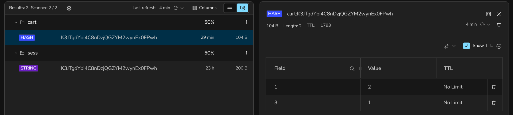

# PC Shop App

## Wybór projektu:

3.6 Cache dla aplikacji e-commerce

## Opis projektu:

Aplikacja to prosty sklep w którym można zakupić części do komputera. Można przeglądać asortyment na głównej stronie i dodawać elementy do koszyka.

Wybrane elementy można podejrzeć w koszyku i zobaczyć jak sumuje się ich cena. Można również usuwać elementy z koszyka, lub wyczyścić cały koszyk.

## Technologie i rozwiązania:

- **Redis** - dane w koszyku użytkownika. Redis świetnie nadaje się do przechowywania tymczasowych informacji, które wymagają szybkiego dostępu - w tym wypadku koszyk.
- **Node.js + Express.js** - backend aplikacji. To połączenie świetnie współgra z bazą redis i pozwala w szybkim tempie przygotować gotowy backend.
- **Pug Templates** - frontent aplikacji. Pomaga w łatwy sposób przygotowac interfejs, który ma dostęp do zmiennych aplikacji. Wystarczające dla tego projektu.

## Funkcjonalności:

- Przeglądanie przedmiotów w sklepie
- Dodawanie przedmiorów do koszyka
- Przeglądanie koszyka
- Usuwanie obiektów w koszyku
- Wyczyszczenie koszyka
- Zatwierdzenie koszyka - "zakup"

## Przykłady użycia

1. Otwarcie głównej strony sklepu
   
2. Dodanie elementu do koszyka:
   
3. Podgląd koszyka
   
4. Usunięcie elementu z koszyka
   
5. Wyczyszczenie koszyka
   
6. Zakupienie koszyka
   

## Konstrukcja bazy danych

Każdy koszyk jest przypisany do sesji użytkownika:
`cart[id_sesji]`. Koszyk to hash mapa w postaci:
_idPrzedmiotu_ -> _ilość_.
Przedmioty i ich ceny przechowywane są lokalnie.

**Podgląd koszyka w Redis Insight**:

## Instalacja

1. Sklonować repozytorium:
   `git clone link-do-repozytorium`
2. Uruchomić terminal w folderze z projektem
3. Utworzyć w katalogu głównym plik `.env` i skopiować do niego zawartośc `.env.example`
4. Uruchomić komendę: `npm run docker:up` aby uruchomić bazę danych Redis
5. Uruchomić komendę `npm run dev` aby uruchomić aplikację
6. Pod adresem: http://localhost:3000 można odwiedzić aplikację
7. Pod adresem: http://localhost:5540 można odwiedzić Redis Insight

## Konfiguracja Redis Insight

Redis Insight pozwala na bieżąco podglądać co się dzieje w bazie danych.

1. Po uruchomieniu bazy dancyh i aplikacji odwiedzić: http://localhost:5540
2. Zaakceptować niezbędne zgody
3. Wybrać opcję: "_+ Connect existing database_"
4. Wybrać "_Connection Settings_"
5. Ustawić "Host" jako "_redis_" i upewnić się, że port jest równy "6379"
6. Opcjonalnie zmienić nazwę pod "Database alias"
7. Wybrać opcję "Add Redis Database" aby zatwierdzić

Na liście pojawi sie nowa baza danych. Po jej kliknięciu uzyska się dostęp do jej podglądu. Aby zobaczyć zmiany w bazie po ich dokonaniu w aplikacji należy wcisnąc przycisk odświeżania u góry tabelki.
